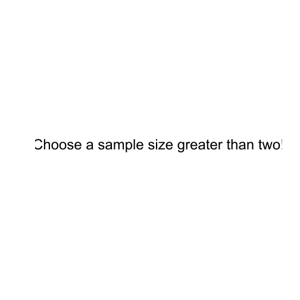

---
output:
  html_document:
    highlight: tango
    includes:
      in_header: header.html
---

<!--..........................................................................-->
<!--..........................................................................-->

<!--..........................................................................-->
<!--..........................................................................-->

<!-- # OLS Case 1: ... {.tabset .tabset-pills} -->

<!-- # Linear Regression Model: Illustration No 01 {.tabset .tabset-pills} -->

# {.tabset .tabset-pills}

  <!-- # Linear Regression Model: Illustration No 01 {.tabset .tabset-pills} -->

  Linear Regression Model: Illustration No 01

  

  Motivation

  Understand the effect of increasing the sample size $N$ on the sampling distribution of the slope coefficient of a linear regression model.

  

  
  Regression Model

  <!-- This illustrations shows the sampling properties of the OLS estimator for the slope coefficient $\beta_1$ of the following linear regression model -->

  We are interested in the sampling properties of the OLS estimator for the slope coefficient $\beta_1$ of the following linear regression model

  \begin{align}
  Y_i &= -2 + 3.5 X_i + u_i, \\
  X_i &\sim N\left(0,10\right), \\
  u_i &\sim N\left(0,10\right).
  \end{align}

  Change the number of observations $N$ to see the effect of the sample size $N$ on the properties of the OLS estimator for the slope coefficient $\beta_1$ of the linear regression model above.

  

  Sample Size

  &nbsp;

  

  <input id="ex6" type="text" data-slider-min="0" data-slider-max="100" data-slider-step="1" data-slider-value="10"/>

  

<!-- 
 -->

<!--   <h3>Change Sample Size</h3> -->

<!--   <input id="ex6" type="text" data-slider-min="0" data-slider-max="100" data-slider-step="1" data-slider-value="10"/> -->

<!-- 
 -->

<!--

Current Slider Value: 3

-->

## Plot No 01

<h3>Check the Effects</h3>

## Plot No 02

<h3>Check the Effects</h3>

## Plot No 03

<h3>Check the Effects</h3>

<!--..........................................................................-->
<!--..........................................................................--> 
<!-- THIS IS THE END --> 

<!-- Include script -->

