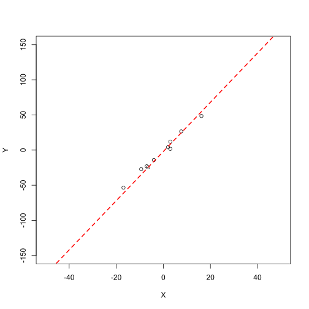
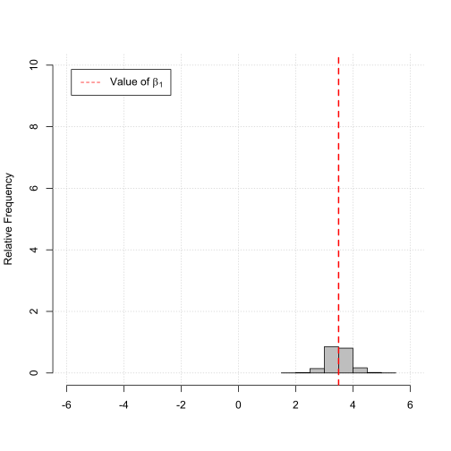
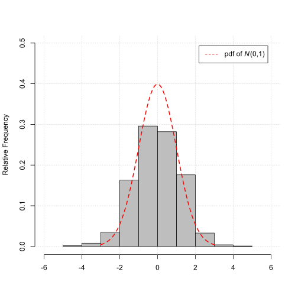

---
output:
  html_document:
    highlight: tango
    includes:
      in_header: header.html
---

<!--..........................................................................-->
<!--..........................................................................-->

<style>

body{
  font-family: Helvetica;
  font-size: 16pt;
}

/* UoH logo */
.logos {
 background-color: #003f75;
 color: white;
 font-family: Arial Nova Cond Light;
 font-size: 24pt;
}


/* Slider input */
/* https://developer.mozilla.org/en-US/docs/Web/HTML/Element/input/range */
datalist {
  display: flex;
  flex-direction: column;
  justify-content: space-between;
  writing-mode: vertical-lr;
  width: 1000px;
}

input[type="range"] {
  width: 1000px;
}


.slider.slider-horizontal{
  /* width:400px; sample value - set it as you like*/
  width:100%; /* sample value - set it as you like*/
}

/*
.jumbotron{
  margin-top:20px;
}
*/

div#top.jumbotron{
  margin-top:100px;
}

</style>

<!--..........................................................................-->
<!--..........................................................................-->

# Properties of OLS Estimates for increasing Sample Size {.tabset .tabset-pills}

<hr>

<!--..........................................................................-->
<span style="font-size: 20pt">Motivation</span>

Understand the effect of increasing the sample size $N$ on the sampling distribution of the ordinary least squares (OLS) estimator for the slope coefficient of a simple linear regression model.

<hr>
  
<!--..........................................................................-->
<span style="font-size: 20pt">Statistical Model</span>

<!-- This illustrations shows the sampling properties of the OLS estimator for the slope coefficient $\beta_1$ of the following linear regression model -->

We are interested in the sampling properties of the OLS estimator for the slope coefficient $\beta_1$ of the following simple linear regression model,

\begin{align}
Y_i &= -2 + 3.5 X_i + u_i,
\end{align}

i.e., for $\beta_1 = 3.5$ and with,

\begin{align}
X_i &\sim N\left(0,10\right), \\
u_i &\sim N\left(0,10\right).
\end{align}

<!-- Change the number of observations $N$ to see the effect of the sample size $N$ on the properties of the OLS estimator for the slope coefficient $\beta_1$ of the linear regression model above. -->

<hr>

<!--..........................................................................-->
<span style="font-size: 20pt">Simulation</span>

1) A sample of size $N$ is drawn from the regression model above.
2) A regression line, i.e., $\beta_0$ and $\beta_1$, are fitted based on the sample drawn.
3) The value of the estimate of interest, i.e., $\widehat{\beta}_1$, is stored.
4) Step 1) to 3) is repeated $1000$ times resulting in $1000$ estimates $\widehat{\beta}_1$.

<p style="margin-left: 40px;">Remember, even if we simulate the observations using the same statistical model, they will never be exactly the same.<p>

5) The distribution of $\widehat{\beta}_1$ and the standardized $\widehat{\beta}_1$ are illustrated using histograms.

<p style="margin-left: 40px;">Remember, due to the different simulated observations the OLS estimates will vary for each sample draw.<p>

<hr>

<!--..........................................................................-->
<span style="font-size: 20pt">Illustration</span>

Change the number of observations $N$ to see the effect of the sample size $N$ on the properties of the OLS estimator for the slope coefficient $\beta_1$ of the linear regression model above.

<hr>


````{=html}

<div class="container">

  <div class="row">
  
    <div class="col-sm-4">
    
      <div class="jumbotron">
      
        <!--..........................................................................-->
        <!-- <span style="font-size: 20pt">Sample Size</span> -->

        <!-- <span style='font-size: 16pt;'>Change the sample size \(N\) using the slider:</span> -->
        
        <span style='font-size: 16pt;'>Sample size \(N\):</span>
        
        <br>
        
        <br>
        
        <!-- <h3>Change Parameters</h3> -->
        
        <input id="ex6" type="text" data-slider-min="1" data-slider-max="100" data-slider-step="1" data-slider-value="10"/>
        
      </div>
      
    </div>
    
    <div class="col-sm-8">

      <div class="jumbotron">
      
        <!-- <h3>Check the Effects</h3> -->
        
        <!--  -->
        
````        


<!--..........................................................................-->
## Plot No 01

<hr>

<span style="font-size: 16pt">Scatterplot Sample Draw</span>

<span style='font-size: 14pt;'>(Based on one sample draw of size $N$ on the DGP)</span>

<span style='font-size: 14pt;'>The plot below illustrates the simulation exercise</span>

<!-- <span style='font-size: 12pt;'>The plot below illustrates the simulation exercise</span> -->

<center>
  
  
  
</center>

<!-- Monte Carlo Experiment: -->

<!-- <span style='font-size: 16pt; text-decoration: underline'>Monte Carlo Experiment</span><span style='font-size: 16pt'>:</span> -->

<!-- 1) A sample of size $N$ is drawn from the DGP. -->
<!-- 2) A regression line, i.e., $\beta_0$ and $\beta_1$, is fitted based on the sample. -->
<!-- 3) The value of estimate, i.e., $\widehat{\beta}_1$ is stored. -->
<!-- 4) Step 1)-3) is repeated $1000$ times resulting in $1000$ estimates $\widehat{\beta}_1$. -->
<!-- 5) The distribution of $\widehat{\beta}_1$ are illustrated using histograms (see Plot No 02 and No 03). -->


<!--..........................................................................-->
## Plot No 02

<hr>

<span style='font-size: 16pt;'>Histogram of the OLS estimator for the slope coefficient $\beta_1$</span>

<span style='font-size: 14pt;'>(Based on 1000 sample draw of size $N$ on the DGP)</span>

<span style='font-size: 12pt;'>The plot below illustrates the Law of Large Numbers (LLN)</span>

<center>
  
  
  
</center>

As the sample size $N$ grows the estimated value $\widehat{\beta}_1$ gets closer to $\beta_1=3.5$, i.e.,

\begin{align*}
\widehat{\beta}_1 \overset{p}{\to} \beta_1 .
\end{align*}


<!--..........................................................................-->
## Plot No 03

<hr>

<span style='font-size: 16pt;'>Histogram of the standardized OLS estimator for the slope coefficient $\beta_1$</span>

<span style='font-size: 14pt;'>(Based on 1000 sample draw of size $N$ on the DGP)</span>

<span style='font-size: 12pt;'>The plot below illustrates the Central Limit Theorem (CLT)</span>

<center>

  
  
</center>

<!-- As the sample size $N$ grows the distribution of the standardized estimated value $\widehat{\beta}_1$ gets closer to the standard normal distribution $N\left(0, 1\right)$. -->

As the sample size $N$ grows the distribution of the standardized estimated value, 

\begin{align*}
z_{\widehat{\beta}_1} = \frac{\widehat{\beta}_1^* - \beta_1}{\sigma_{\widehat{\beta_1}}},
\end{align*}

gets closer and closer to the standard normal distribution $N\left(0, 1\right)$.

<!-- \begin{align*} -->
<!-- \widehat{\beta}_1 \overset{d}{\to} N\left(\beta_1 , \sigma_{\widehat{\beta}_1}^{2} \right). -->
<!-- \end{align*} -->

      
        
````{=html}        
        
      </div>

    </div>
    
  </div>
  
</div>

````


<!--..........................................................................-->
<!--..........................................................................--> 
<!-- THIS IS THE END --> 

<!-- Include script -->
<script src="https://cdnjs.cloudflare.com/ajax/libs/bootstrap-slider/10.0.0/bootstrap-slider.min.js"></script>
<script>

//var slider = new Slider("#ex6", {
//  tooltip: 'always'
//});

var slider = new Slider("#ex6", { tooltip: 'always' });
slider.on("slide", function(sliderValue) {
//document.getElementById("ex6SliderVal").textContent = sliderValue;
document.getElementById("img01").setAttribute("src", "plot_01_N" + sliderValue + ".svg");
document.getElementById("img02").setAttribute("src", "plot_02_N" + sliderValue + ".svg");
document.getElementById("img03").setAttribute("src", "plot_03_N" + sliderValue + ".svg");
});

</script>

